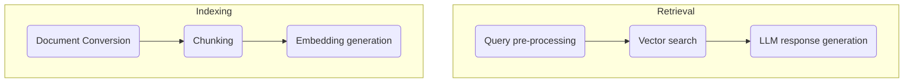

Recently, I had the opportunity to build an interesting [RAG (Retrieval-Augmented Generation)](https://en.wikipedia.org/wiki/Retrieval-augmented_generation){:target="_blank"} system.
What made it uniquely challenging (and exciting!) was the fact that it was part of a larger project which was specifically designed to run **on-prem**, in an **air-gapped** environment. This meant that the underlying infrastructure had to exist and run **fully offline**. 

In this blog post, we'll take a look at the system's architecture, the challenges faced and some advanced techniques and optimizations that made it all come together.

## Setting a vision

Before starting a project, I think it's always good to set a few high-level goals. These goals help immensely with downstream technical decisions and serve as guiding principles for the project.  
Following were my goals for this RAG system, in order.

- Secure and Compliant
- Accurate and Robust
- Highly Performant (High throughput, Low latency)
- Simple and Modular

## Starting with the basics

At its core, a RAG system is responsible for 2 things — **Indexing** and **Retrieval**.  
In a basic setup, the pipelines might look something like this.

We take a document, convert it to a common format like *Markdown*, split it into fixed-size chunks (with some overlap), create vector embeddings and persist them to our database. Then, at query time, we do a vector search on the indexed chunks, pick the most relevant/best ranking ones and feed them to an LLM to generate a response.

It works, and for many cases, this might be good enough... but we're looking for something a bit more serious ;)

## Raising the bar

The basic RAG system described above has **many limitations**. It doesn't, for example, do a very good job at searching for **exact terms, phrases, or IDs**. Fixed-size chunking misses **semantic and structural shifts** across texts and ends up splitting text abruptly. It also doesn't handle metadata like **tags, section IDs, and page numbers** which could be used at query time to condense our search space and provide helpful citations to users. It doesn't handle summarization for **large documents** that exceed the size of our context window. And a pretty major one, it doesn't understand **scanned documents** at all!

After multiple deep dives, trials and errors and iterations into the effort, this is how we solved each of the above challenges.

- **Hybrid document conversion** - Along with native text extraction libraries like [pypdf](https://github.com/py-pdf/pypdf), [markitdown](https://github.com/microsoft/markitdown) and [python-pptx](https://github.com/scanny/python-pptx), we integrated [PaddleOCR](https://github.com/PaddlePaddle/PaddleOCR), particularly, their recent [PaddleOCR-VL](https://huggingface.co/PaddlePaddle/PaddleOCR-VL) model for OCR. 
- **Semantic chunking** - After exploring multiple libraries, we settled on [Chonkie](https://github.com/chonkie-inc/chonkie). It gave us exactly what we were looking for — a tiny, chunking-focused library implementing semantic chunking with advanced features like *Savitzky-Golay filtering* and *Skip-window merging*.
- **Hybrid search** - We combined vector search with keyword search, joined our results using [RRF](https://www.elastic.co/docs/reference/elasticsearch/rest-apis/reciprocal-rank-fusion) and fed them through a cross-encoder for reranking. For keyword search, we first experimented with [PostgreSQL's native FTS](https://www.postgresql.org/docs/current/textsearch.html) but found the gold standard [BM25](https://en.wikipedia.org/wiki/Okapi_BM25) algorithm to be much better. 
- **Contextual retrieval** - This technique [introduced by Anthropic in 2024](https://www.anthropic.com/engineering/contextual-retrieval) improves semantic search by contextualizing each chunk w.r.t its place in the document. This is typically very costly in terms of performance, since we need to run LLM inference on each chunk. [vLLM's prefix caching](https://docs.vllm.ai/en/stable/design/prefix_caching/) made this an effective and viable approach for us. 
- **Map-reduce summarization** - This comes directly from the well established [MapReduce](https://en.wikipedia.org/wiki/MapReduce) programming model for distributed systems. For summarizing large documents that don't fit entirely in the context window of our LLM, we summarize document chunks in parallel, and then aggregate the summaries. We do this recursively until we get a final, cohesive summary.

Finally, [this](#page-top) is what our pipelines evolved to look like.

## The tech stack

Being constrained to an offline environment, we built the system using the best, *permissively-licensed*, [FOSS](https://en.wikipedia.org/wiki/Free_and_open-source_software) tools.

- **[vLLM](https://vllm.ai/)** - High-throughput LLM inference
- **[FastAPI](https://github.com/fastapi/fastapi)** - Async REST API
- **[Celery](https://docs.celeryq.dev/en/stable/)** - Distributed task queue for background indexing jobs
- **[Haystack](https://haystack.deepset.ai/)** - LLM framework. [Langchain](https://www.langchain.com/) is another solid option
- **[Postgres](https://www.postgresql.org/)** - Powered by the [pgvector](https://github.com/pgvector/pgvector) and [pg_textsearch](https://github.com/timescale/pg_textsearch) extensions, Postgres served as our Vector and BM25 Index
- **[Redis](https://redis.io/)** - Cache and Message Broker

## Resources

Following are some great resources that helped me during my RAG deep dive.  
1. **vLLM Performance Tuning** - <https://docs.vllm.ai/en/stable/configuration/optimization/>
2. **Anthropic Contextual Retrieval Blog** - <https://www.anthropic.com/engineering/contextual-retrieval/>
3. **Hugging Face MTEB Leaderboard** - <https://huggingface.co/spaces/mteb/leaderboard/>
4. **Tiger Data BM25 Blog** - <https://www.tigerdata.com/blog/you-dont-need-elasticsearch-bm25-is-now-in-postgres>
5. **Chonkie** - <https://docs.chonkie.ai/>

## Conclusion

The system is by no means **complete**. There are many potential improvements like [GraphRAG](https://arxiv.org/abs/2501.00309), which grounds the entities and relationships in data into a Graph database which can then be used to answer queries that span facts/entities across documents. We could also make the system *[Agentic](https://www.ibm.com/think/topics/agentic-rag)* by arming it with tools and long-term memory so that each query is processed using an optimized plan.

That's it for today :wave:!  

If you found this useful or want to discuss anything further, feel free to reach out to me [here](mailto:hello@robinsharma.me).